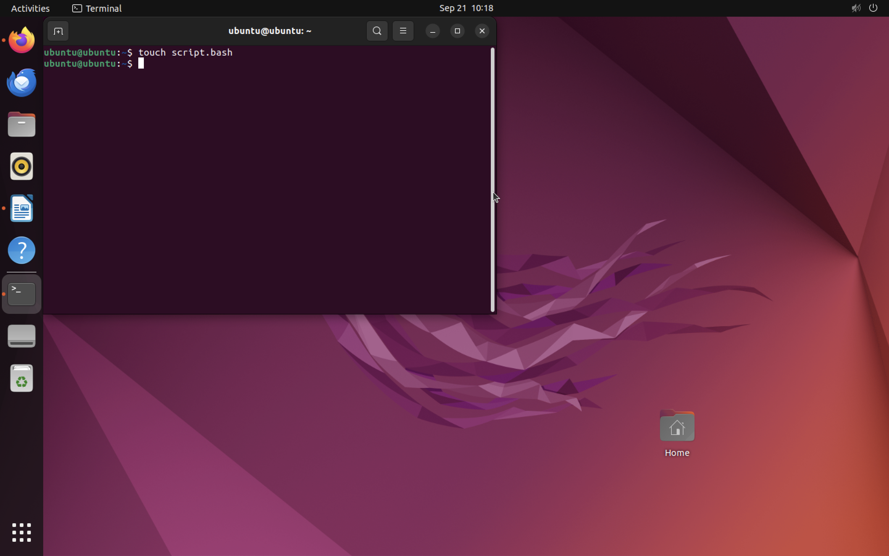

# Лабораторная работа №1 Пластинина Мария К3161
1) Я установила дистрибутив Linux Ubuntu и запустила его.

2) Следующим шагом я открыла Терминал для выполнения дальнейшей работы.

3) При помощи команды touch я создала новый файл script.bash

4) Через команду gedit я открыла файл для редактирования.

5) В самом редакторе первой строкой я ввела директиву #!/bin/bash для выполнения команд в оболочке Bash.

6) Далее я ввела команду echo, которая должна выводить предложение "Welcome to ITMO University" при запуске скрипта.

7) Для проверки правильности моих действий я использовала команду bash.

Все выполнено верно, перехожу к решению задачи.

8) Моя задача заключалась в том, чтобы модифицировать файл script.bash так, чтобы при его запуске выводилось любое количество аргументов, написанных после команды bash script.bash. Для этого в своем скрипте я использовала команду $@, которая перерабатывает все поступившие аргументы.

9) Проверим, работает ли данная команда, как поставлено в задаче.

10) Для того, чтобы убедиться, что данная команда работает и на длинных аргументах, введу длинное имя.

